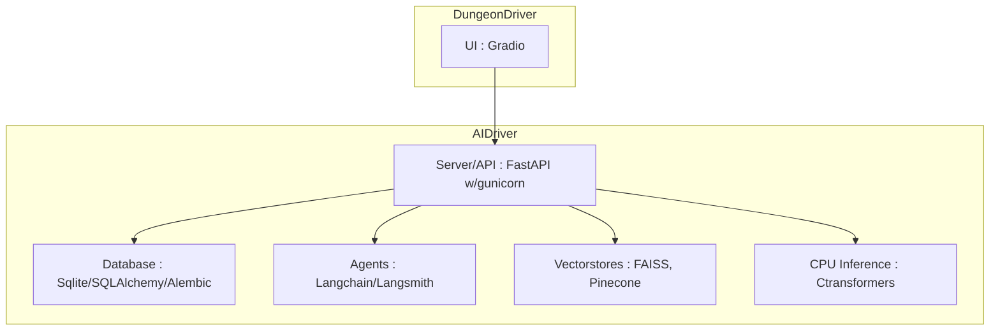

# DungeonDriver: Your Dungeon Diving Companion


[](https://github.com/fearnworks/dungeondriver/actions/workflows/python-publish.yml)
[](https://github.com/fearnworks/dungeondriver/actions/workflows/pytest.yml)


Disclaimer:
This project is pre-alpha and not ready for use. We are currently in the process of building out the core functionality. Please check back soon!
====


Welcome to DungeonDriver, your must-have companion for a truly immersive gaming adventure! Whether you're exploring perilous dungeons, battling mighty dragons, or embarking on an epic quest, DungeonDriver takes your gaming parties to the next level. Our goal is to build a dynamic set of tools allowing you to dive into a world of personalized experiences, dynamic interactions, and magical moments. All capable of being hosted from your very own hardware

Are you ready to enhance your tabletop escapades and redefine how you play? With DungeonDriver, you're not just a player—you're a legendary hero on a grand journey. Gather your party, embark on unforgettable stories, and let DungeonDriver be the trusted companion that guides you every step of the way. Get ready to level up your gaming experience like never before!

## 🌟 Features
- Cloud Based Inference
- Local Inference (GPU & CPU)
- Game Manual Q&A
- RPG Focused Stable Diffusion Prompt Generation

### Roadmap
- Dynamic Campaign Creation: Utilize our intelligent assistant to generate and manage intricate and immersive campaigns tailored to your party's preferences.
- Adaptive Encounters: Experience the ease of running thrilling battles and challenges that adapt in real-time based on player actions and decisions.
- Automated World-Building: Leverage the Dungeon Master assistant to build rich, dynamic worlds filled with diverse locations, NPCs, and events.
- Player Engagement Tools: Enhance your games with tools designed to engage players, track character progression, and share memorable moments.
- Real-Time Assistance: Get real-time suggestions for game scenarios, rules references, and narrative prompts, allowing you to focus more on storytelling and less on logistics.
- Community Connection: Share your unique campaigns, learn from other Dungeon Masters, and celebrate your victories within our DM assistant community.

## Architecture
This project is split into two main components :
- DungeonDriver : A interface containing table top RPG logic and interfaces with the AI Driver inference server
- AI Driver : A FastAPI inference server that handles all of the details of running inference on the models.

These items are currently set up to run locally through docker-compose but can be easily split into separate containers for deployment.

AI Driver Technologies :
- Server/API : FastAPI w/gunicorn
- Database: Sqlite/SQLAlchemy/Alembic
- Agents : Langchain/Langsmith
- Vectorstores : FAISS, Pinecone
- CPU Inference : Ctransformers (GGML)

DungeonDriver Technologies :
- UI : Gradio



## 🚀 Getting Started
DungeonDriver and its companion inference server AI Driver are meant to be run inside of container for easy deployment in any environment. Docker and Docker Compose must be installed in your environment. Cuda drivers are required for GPU support. Drivers should be capable of running cuda 12.x

```bash
git clone https://github.com/fearnworks/dungeondriver
```

Ai Driver setup
```bash
cp .envexample .env
docker-compose up --build
```

Download the models and place them in the top level artifacts folder. There is a helper script here :
[Title](ai_driver/ai_driver/scripts/download_model.py)

We'll be adding more mature support for model downloads in the future

## 💡 Contributing

We welcome contributions to DungeonDriver! Follow the [Contributing Guidelines](./CONTRIBUTING.md) to get started.

## ❓ FAQ

# STUB

## 📬 Contact

Got questions or feedback? Feel free to reach out to us here on github!
